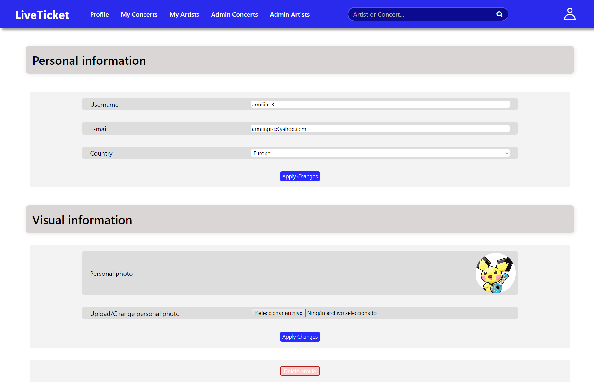
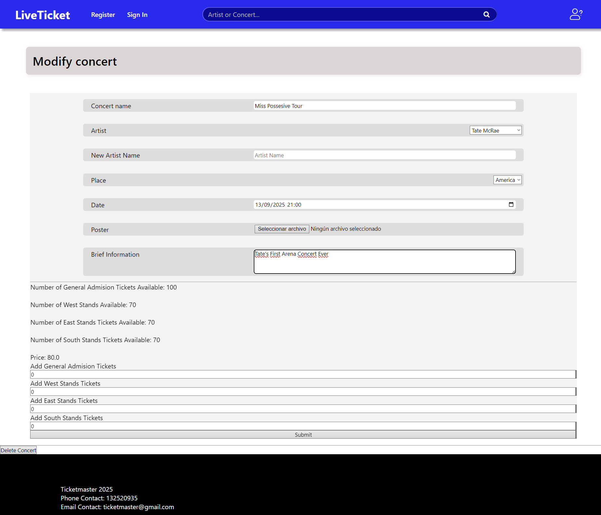

# Name of the Application TBD

## Participants of Group 16

<table>
  <thead>
    <th>Full Name</th>
    <th>Degree</th>
    <th>University Email</th>
    <th>Github Account</th>
  </thead>
  <tbody>
    <tr>
      <td>Arminda García Moreno</td>
      <td>GII + MAT</td>
      <td>a.garciamore.2022@alumnos.urjc.es</td>
      <td>armiiin-13</td>
    </tr>
    <tr>
      <td>Alfonso Rodríguez Gutt</td>
      <td>GII</td>
      <td>a.rodriguezgu.2022@alumnos.urjc.es</td>
      <td>AlfonsoRodr</td>
    </tr>
    <tr>
      <td>David Rísquez Gómez</td>
      <td>GII + GMAT</td>
      <td>d.risquez.2022@alumnos.urjc.es</td>
      <td>davidrisqgom</td>
    </tr>
  </tbody>
</table>

## Execution Instructions
1. Download the repository and unzip it.
2. Run the application in your preferred IDE. We recommend that you use `Visual Studio Code`.
3. Once the application is running, open your prefferred browser and go to: `http:\\localhost:8080/`.
4. You can access the application as an administrator by using one of the following accounts:
   * Username: armiiin13; Password: eras1325.
   * Username: Fonssi29; Password: pollitoPio.
   * Username: davih; Password: davilico.

In addition to the steps above, you will need to meet the following requirements:

### Java 21 (JDK 21)
In case you do not have JDK installed in your computer, this is how you can get it:
* If you are a Windows user [Click Here](https://download.oracle.com/java/21/latest/jdk-21_windows-x64_bin.zip).
* If you use Linux as your operative system, you will need to put the following command in the terminal:
```sh
sudo apt install openjdk-21
````

### Maven v0.44.0
If you are using `Visual Studio Code` as your IDE, you can get it by searching the `Maven for Java` extension.

In other case, you can get it [Here](https://maven.apache.org/download.cgi).

### Spring Boot 3.4.2
The reason we strongly recommend using `Visual Studio Code` as the IDE to launch the application, is because of the Spring Boot version. In this IDE, it is possible to use version `3.4.2`, however, in other IDEs such as `SpringToolSuite` the higher version available is `3.4.1`, so it may not work as it should.

At this time, version `3.4.3` is available, however we do not recommend using it for this project.

If you use `Visual Studio Code`, you will need to have the `Spring Boot Extension Pack` extension.

## Entities Information
Next, all the entities that are part of the application will be shown, as well as the relationships between them.

### UserEntity
<table>
  <thead>
    <th>Related Entity</th>
    <th>Cardinality</th>
    <th>Annotation</th>
  </thead>
  <tbody>
    <tr>
      <td>Artist</td>
      <td>1..N</td>
      <td>@OneToMany</td>
    </tr>
    <tr>
      <td>Ticket</td>
      <td>1..N</td>
      <td>@OneToMany(mappedBy="ticketUser")</td>
    </tr>
  </tbody>
</table>

### Artist
<table>
  <thead>
    <th>Related Entity</th>
    <th>Cardinality</th>
    <th>Annotation</th>
  </thead>
  <tbody>
    <tr>
      <td>Concert</td>
      <td>1..N</td>
      <td>@OneToMany(mappedBy = "artist", cascade=CascadeType.ALL, orphanRemoval=true)</td>
    </tr>
  </tbody>
</table>

### Concert
<table>
  <thead>
    <th>Related Entity</th>
    <th>Cardinality</th>
    <th>Annotation</th>
  </thead>
  <tbody>
    <tr>
      <td>Artist</td>
      <td>N..1</td>
      <td>@ManyToOne</td>
    </tr>
    <tr>
      <td>Ticket</td>
      <td>1..N</td>
      <td>@OneToMany(mappedBy="concert", cascade=CascadeType.ALL, orphanRemoval=true)</td>
    </tr>
  </tbody>
</table>

### Ticket
<table>
  <thead>
    <th>Entity</th>
    <th>Cardinality</th>
    <th>Annotation</th>
  </thead>
  <tbody>
    <tr>
      <td>UserEntity</td>
      <td>N..1</td>
      <td>@ManyToOne</td>
    </tr>
    <tr>
      <td>Concert</td>
      <td>N..1</td>
      <td>@ManyToOne</td>
    </tr>
  </tbody>
</table>

To provide better clarity when viewing these relationships, the relational diagram of the application is shown below.


## User Privileges
Anonymous users will be able to search for artists and concerts and visit the artist's page for information, but they will not be able to purchase tickets to a concert. They can also register or log in on the page to become registered users.

In addition to the actions that an anonymous user can take, registered users can purchase tickets and modify their profile page (and add a profile photo that the page did not request when they registered). They will be able to see their purchased tickets and, in the future, they will be able to create a list with their favorite artists.

Admin users can do all this and also create, modify and delete concerts and artists. In their profile photo they have two options: "Concert Manager" and "Artist Manager", where each link takes them to the corresponding page.

Regarding the entities that the user owns, anonymous users have nothing to own, but each registered user and administrator will own a list of tickets, which is the list of tickets that the user has purchased. 

> ![NOTE]
> In the future, these types of users will also have an artist list, which contains the user's favorite artists.

## Image Management
The user entity has only one image associated with it, this being its profile picture.

The artist entity has three images associated with it, these being its photo and two album covers (of the albums that the administrator fill out information for in the corresponding form). 

The concert entity has only one image associated with it, this being its promotional poster.

## Application Functionality Overview
### ScreenShots
- Main Page

Description: this is the main page of the web. If the user is logged it will show the concerts on his continent so he can access to them more easily. On the other case, it will show all the concerts kept in the database (this will change in later versions of the web). In these two cases, then its showed a display of the new artist added (only if it has a page to show). It also has the header which lets you to log in or register (if its an anonymous user) or to visit your profile, see your list of favourite artist and see the tickets that you have purchase. This header also has a search bar that lets you to search whatever concert or artist you want. It also contains the footee with the main information of the page (as a company).

- Search Page

Description: this is the page that shows the results of the search done in the header searchbar. First, it will show the artists whose names contains the string searched. Then, it will display the concerts that are by said artists and the concerts whose names contains that string. If the user is logged, prior to this display it will show the same (concerts by the artists and concerts with the string) that take place at the user's continent. This page also has the header as the main page.

- Artist Page

Description: this page will show the artist information saved at the database. If there is no artist or the artist does not have a page, it will show a message telling so. This page shows the artist's photo next to the main information paragraph. Below this, it will show the extended information paragraph with additional information of the artist. Then, it will show the artist's two albums saved on the database as a photo with their respective Spotify and Apple Music's links inside to photos of the logos of said apps. At last, it will show a display of the concerts that this artist will be playing in every continent, with the possibility to go to the select tickets page for that concert. This page also has the header and the footer as the main page.

- Select Tickets Page

Description: this page will only be accessible if the user is logged. It will show a predetermined map of the arena where the concert is going to take place (is the same for every concert) and next to it will be a form so the user can choose the type of ticket he wants and the number of them. It also shows the price of the tickets. This page also has the header as the main page.

- Purchase Page

Description: on this page the user will have to enter his back data so he can purchase the tickets. First, the page shows the information of the tickets that the user is going to buy, giving him the option to cancel the purchase (which takes him back to a page thats shows a message telling the cancelation was succesfull). Below that is the form I named earlier, where the user has to enter its bank account data to purchase the tickets.

- Profile Page

Description: this page will show the main information of the user, giving him the option to change it. It will also let him to add/ change a profile picture. This page also has the header as the main page.

- My Concerts' Page

Description: this page will show the tickets the user has purchased. By hovering over each one, the ticket turns over and shows the ticket details as well as the name of the user who purchased it. This page also has the header as the main page.

- Administrator Pages

Description: these pages will show a button to add a concert or artist and all the artists/ concerts saved at the database (so the administrator can select them in order to modify them). It also includes a searchbar that lets the administrator to shorten this list to find the concert/ artist he wants to modify in an easier way.

- Add/ Modify Concerts (Administrator)

Description: this page will display a form that the administrator will fill out with the information of a brand new concert or will display a form with an existing concert data so the administrator can change it. There are some differences with each display: on the brand new concert form, the administrator should enter the number of tickets available for each type and its general price; on the modify concert form, it will show the information of how many tickets are left of each type and its type, letting the administrator only to indicate how many tickets of each type he wants to add. Also, in the modify concert form is a button to delete the concert.

- Add/ Modify Artists (Administrator)

Description: this page is similar to the concert one, with the peculiarity that there is a preview of the artist miniature that autocompletes at the same time that the administrator is entering the data.

- Log In/ Register Pages

Description: these pages display a form so the user can log in or register. Each page lets the user to go to the other page if he wants to do the other activity. In the register form, the user has to enter his username, email, password and country but to log in, he only has to enter its username and his password.

- Message Pages

Description: these pages are destined to show a message telling the user some information. These pages include the error page (static) that appears when an error has ocurred, the pages telling the administrator that the concert has been added/ modified/ deleted succesfully and the welcome pages when the user logs in or registers.

### Navigation Diagram
* Blue: all users
* Green: registered users and administrators
* Purple: only administrators
* Note: from any page you can reach the error page


### Classes and Templates Diagram


Additionally, to provide more information and better clarity of how the application works, it was decided to make some additional diagrams about the main functionalities of the application. These are the following:

### Sign In Comunication Diagram

> [!NOTE]
> Any errors that may occur during this action are not reflected in this diagram. The only error that could occur is that the username does not exist in the database, or the password does not match the one registered. If any of this happens, an error message will appear on the form itself.
### Sign Up Comunication Diagram

> [!NOTE]
> Any errors that may occur during this action are not reflected in this diagram. The only error that could occur is that the username does not exist in the database. If this happens, an error message will appear on the form itself.

### Ticket Purchase Activity Diagram


### Add Artist Comunication Diagram


### Modify Artist Comunication Diagram


### Add Concert Comunication Diagram


### Modify Concert Comunication Diagram


## Team Members Participation
In this section, each of the participants in the development of the application will explain the tasks they have been responsible for, showing their most notable commits, and those files on which they worked the most.

To coordinate the team, we have used the Trello application, which allows us to create Kanban panels virtually.

The following link leads to our team dashboard:
[Link to the Trello Dashboard](https://trello.com/b/6p7qKvZK/ticketmaster-ssdd)

>[!IMPORTANT]
> Merge commits are not being considered to calculate the participation of each member on a file. This is because merge commits are commits that GitHub does when there has been an new upload while someone was working on the repository. So, looking on the merge commit it will appear that a member has touched a file, when that is not the case (also the commit will show the same code the other member uploaded on a earlier commit).

## Alfonso Rodríguez Gutt

### Commit List
1. [Adding all User files (Entity, Service and Repository)](https://github.com/SSDD-2025/Grupo-16/commit/04e8fe9fb732fa6bf1aa67009ebd2a9d1cfafaee).
2. [Adding all Ticket files (Entity, Service and Repository)](https://github.com/SSDD-2025/Grupo-16/commit/db40a969aab6353c5729374c2beefb25568a1102).
3. [Addition to the TicketController of the ticket purchase method.](https://github.com/SSDD-2025/Grupo-16/commit/bcf4139c1fcbdff3650e72fffc5418e7b155c4b6).
4. [Finished the implementation of Cancel Purchase](https://github.com/SSDD-2025/Grupo-16/commit/f4b9c00c2eb97dd5ad5c5ab38b6a5081dad9e6b7).
5. [Re-design of the sign-in/sign-up page](https://github.com/SSDD-2025/Grupo-16/commit/5383e7c5c7b46133c9e9a3a6c26a8f4f0283cddc).

> [!IMPORTANT]
> Accessing commits with the links specified above may not reflect the current version of the file. This is because there were smaller commits after that, where small errors were corrected, comments were added, etc.

### Files with the most participation
1. UserController.java
2. UserService.java
3. TicketController.java
4. TicketService.java
6. ConcertRepository.java

In addition to these files, I worked on other files with a lower workload, or that did not have the same level of importance as the previous ones mentioned. These are:
1. UserEntity.java
2. UserRepository.java
3. Ticket.java
4. TicketRepository.java
5. ConcertService.java
6. CardVerifyingService.java
7. sign-in.html and its correspondant css (sign-in-styles.css).
8. error.html and its correspondant css (message-styles.css). This css is made in collaboration with colleague Arminda García Moreno.
9. sign-in-validation.html and its correspondant css (validation-styles.css).
10. sign-up-validation.html and its correspondant css (validation-styles.css).
11. purchase-confirmation.html and its correspondant css (purchase-confirmation-styles.css).
12. cancel-verification.html.

Once the files in which I was a participant have been mentioned, I will explain in detail what was done in the most notable files:

### UserController
This `@Controller` will be in charge of managing everything related to user actions in the web application.

This will be all the methods this `@Controller` will have:

> [!IMPORTANT]
> The methods that I will explain below will be those carried out by me, the rest of the methods will be explained by the corresponding author.

<table>
  <thead>
    <th>Name</th>
    <th>Returning Template</th>
    <th>Mapping Type</th>
    <th>URL</th>
    <th>Parameters</th>
    <th>Description</th>
  </thead>
  <tbody>
    <tr>
      <td>signInUser</td>
      <td>sign-in</td>
      <td>@GetMapping</td>
      <td>/sign-in</td>
      <td>Model model</td>
      <td>It will show the log in display by setting the mustache variable (existUser) to true</td>
    </tr>
    <tr>
      <td>signUpUser</td>
      <td>sign-in</td>
      <td>@GetMapping</td>
      <td>/sign-up</td>
      <td>Model model</td>
      <td>It will show the register display by setting the mustache variable (existUser) to false</td>
    </tr>
    <tr>
      <td>verifySignIn</td>
      <td>sign-in-validation or sign-in (in case of error)</td>
      <td>@PostMapping</td>
      <td>/sign-in/validation</td>
      <td>Model model, @RequestParam String userName, password</td>
      <td>It will verify if the given userName and password matches with the one in the database, and establish a session to that user.   
       If there any error, an error message will be shown
      </td>
    </tr>
    <tr>
      <td>verifySignUp</td>
      <td>sign-up-validation or sign-in (in case of error)</td>
      <td>@PostMapping</td>
      <td>/sign-up/validation</td>
      <td>Model model, @RequestParam String userName, password, country, email</td>
      <td>It will try to register the user in the database (if he does not exist) and establish him a session. If the user is already in 
      the database or an error occurs, the user will be notified</td>
    </tr>
  </tbody>
</table>

It will have an instance of the `UserService` class, which will be under the `@AutoWired` annotation.

### UserService
This `@Service` will serve as an intermediate between the `UserController` and the `UserRepository` in order to follow the `Hexagonal Arquitecture`. This service will have all the operations the `@Controller`s will need in order to access the data on the database, in other words, the querys.

This are the methods that this `@Service` will have:

> [!IMPORTANT]
> The methods that I will explain below will be those carried out by me, the rest of the methods will be explained by the corresponding author.

<table>
  <thead>
    <th>Name</th>
    <th>Return Type</th>
    <th>Description</th>
    <th>Parameters</th>
  </thead>
  <tbody>
    <tr>
      <td>verifyUser</td>
      <td>UserEntity or null (in case the user does not exists)</td>
      <td>It will verify if exists an user with the given userName in the database</td>
      <td>String userName</td>
    </tr>
    <tr>
      <td>verifyPassword</td>
      <td>boolean</td>
      <td>It will verify if the given password matches the one in the database. This method will always be called after the verifyUser     
       one</td>
      <td>String userName, password</td>
    </tr>
    <tr>
      <td>registerUser</td>
      <td>UserEntity</td>
      <td>It will save a given user in the database. If there will be any error, and exception will be thrown</td>
      <td>UserEntity newUser</td>
    </tr>
    <tr>
      <td>recoverUser</td>
      <td>UserEntity</td>
      <td>It will recover the information of a given user, in order to establish his session</td>
      <td>String userName, password</td>
    </tr>
  </tbody>
</table>

There will be an instance of the `UserRepository` from which all the querys will be made.

### TicketController
This `@Controller` will be in charge of managing everything related to the tickets for the different concerts that are registered in the application.

This will be all the methods this `@Controller` will have:

> [!IMPORTANT]
> The methods that I will explain below will be those carried out by me, the rest of the methods will be explained by the corresponding author.

<table>
  <thead>
    <th>Name</th>
    <th>Returning Template</th>
    <th>Mapping Type</th>
    <th>URL</th>
    <th>Parameters</th>
    <th>Description</th>
  </thead>
  <tbody>
    <tr>
      <td>showPurchaseInformation</td>
      <td>String</td>
      <td>@PostMapping</td>
      <td>/concert/{id}/purchase</td>
      <td>Model model, @PathVariable long id, @RequestParam String number, ticketType</td>
      <td>Once the ticket is chosen, it will show all the relevant information regarding the concert selected by the user, and the tickets to be purchased</td>
    </tr>
    <tr>
      <td>showPurchaseConfirmation</td>
      <td>purchase-confirmation</td>
      <td>@PostMapping</td>
      <td>/concert/{id}/purchase/confirmation</td>
      <td>Model model, @PathVariable long id, @RequestParam String ticketType, @RequestParam int number</td>
      <td>It will show the "purchase-confirmation.html" template</td>
    </tr>
    <tr>
      <td>cancelPurchase</td>
      <td>cancel-verification</td>
      <td>@PostMapping</td>
      <td>/concert/{id}/cancel-purchase</td>
      <td>Model model, @PathVariable long id, @RequestParam String type, @RequestParam int number</td>
      <td>It will cancel the purchase.</td>
    </tr>
  </tbody>
</table>

It will have an instance of the `ConcertService` and `TicketService` classes, which will be under the `@AutoWired` annotation.

### TicketService
This `@Service` will serve as an intermediate between the `TicketController` and the `TicketRepository` in order to follow the `Hexagonal Arquitecture`. This service will have all the operations the `@Controller`s will need in order to access the data on the database, in other words, the querys.

This are the methods that this `@Service` will have:

> [!IMPORTANT]
> The methods that I will explain below will be those carried out by me, the rest of the methods will be explained by the corresponding author.

<table>
  <thead>
    <th>Name</th>
    <th>Return Type</th>
    <th>Description</th>
    <th>Parameters</th>
  </thead>
  <tbody>
    <tr>
      <td>getTicket</td>
      <td>Ticket</td>
      <td>Obtain a ticket form the database</td>
      <td>long id</td>
    </tr>
    <tr>
      <td>createTicket</td>
      <td>Ticket</td>
      <td>Creates a new Ticket and save it in the database</td>
      <td>String zone, float price, Concert concert</td>
    <tr>
      <td>associateUserWithTicket</td>
      <td>void</td>
      <td>This method will create a ticket (by calling the createTicket method); and associate it with its owner (setting the ticket to that user). And vice versa, it will update the user's ticket list with the new ones. Finally, once both entities are updated, they will be saved in their respective repositories.</td>
      <td>String type, int number, long idConcert</td>
    </tr>
  </tbody>
</table>

There will be an instance of `TicketRepository` , `UserRepository` and `ConcertRepository` from which all the querys will be made. Adittionally, an `ActiveUser` instance will also be present.

### ConcertRepository
This is not a class created by me, it is one in which I collaborated by adding the 4 queries to the concert database that will be mentioned below. In addition, these queries controlled the concurrency problems that could be generated when trying to purchase a greater number of tickets than available.

<table>
  <thead>
    <th>Method Name</th>
    <th>Return Type</th>
    <th>Description</th>
    <th>Parameters</th>
  </thead>
  <tbody>
    <tr>
      <td>availableWestStandsTickets</td>
      <td>int</td>
      <td>It will make a @Query obtaining the number of West Side Tickets required. It will control the concurrent access to the repository, thus preventing a user from trying to obtain a number of tickets greater than the one available.</td>
      <td>@Param ("id") long id, @Param ("number") int number</td>
    </tr>
    <tr>
      <td>availableEastStandsTickets</td>
      <td>int</td>
      <td>It will make a @Query obtaining the number of East Side Tickets required. It will control the concurrent access to the repository, thus preventing a user from trying to obtain a number of tickets greater than the one available.</td>
      <td>@Param ("id") long id, @Param ("number") int number</td>
    </tr>
    <tr>
      <td>availableSouthStandsTickets</td>
      <td>int</td>
      <td>It will make a @Query obtaining the number of South Side Tickets required. It will control the concurrent access to the repository, thus preventing a user from trying to obtain a number of tickets greater than the one available.</td>
      <td>@Param ("id") long id, @Param ("number") int number</td>
    </tr>
    <tr>
      <td>availableGeneralAdmissionTickets</td>
      <td>int</td>
      <td>It will make a @Query obtaining the number of General Admission Tickets required. It will control the concurrent access to the repository, thus preventing a user from trying to obtain a number of tickets greater than the one available.</td>
      <td>@Param ("id") long id, @Param ("number") int number</td>
    </tr>
    <tr>
      <td>restoreWestStandsTickets</td>
      <td>int</td>
      <td>It will make a @Query restoring the number of westStand tickets that the user has selected, when he cancel the purchase</td>
      <td>@Param ("id") long id, @Param ("number") int number</td>
    </tr>
    <tr>
      <td>restoreEastStandsTickets</td>
      <td>int</td>
      <td>It will make a @Query restoring the number of eastStand tickets that the user has selected, when he cancel the purchase</td>
      <td>@Param ("id") long id, @Param ("number") int number</td>
    </tr>
    <tr>
      <td>restoreNorthStandsTickets</td>
      <td>int</td>
      <td>It will make a @Query restoring the number of northStand tickets that the user has selected, when he cancel the purchase</td>
      <td>@Param ("id") long id, @Param ("number") int number</td>
    </tr>
    <tr>
      <td>restoreGeneralAdmissionTickets</td>
      <td>int</td>
      <td>It will make a @Query restoring the number of generalAdmission tickets that the user has selected, when he cancel the purchase</td>
      <td>@Param ("id") long id, @Param ("number") int number</td>
    </tr>
  </tbody>
</table>

### ConcertService
Although this file is not included in the 5 files in which I participated the most, it is a service in which, as with the `ConcertRepository`, I participated with a method to verify if there are available entries of a specific type:

<table>
  <thead>
    <th>Method Name</th>
    <th>Return Type</th>
    <th>Description</th>
    <th>Parameters</th>
  </thead>
  <tbody>
    <tr>
      <td>existConcert</td>
      <td>boolean</td>
      <td>It will verify if the concert exist or not.</td>
      <td>Concert concert</td>
    </tr>
    <tr>
      <td>verifyAvailability</td>
      <td>boolean</td>
      <td>It will check if there are tickets available of a certain type</td>
      <td>long id, int number, String type</td>
    </tr>
    <tr>
      <td>restauringTickets</td>
      <td>void</td>
      <td>This method will restore the selected tickets when the user cancel de purchase</td>
      <td>long id, int number, String type</td>
    </tr>
  </tbody>
</table>

## Arminda García Moreno

### Commit List
1. [Adding and modifing concerts as an administrator.](https://github.com/SSDD-2025/Grupo-16/commit/01685b168b47b0e61289a6104313b0444fe36427)
2. [Added the ArtistController method to show the artist's page and modificated the HTML to be consistent.](https://github.com/SSDD-2025/Grupo-16/commit/5c3604a057ff7e083c25c96aeaa310d7d967a923)
3. [MainController mapping to "/" and Artist classes created.](https://github.com/SSDD-2025/Grupo-16/commit/18d390fc4e643460db3198fe4f469e2035d1a2a0)
4. [Administrator Concert Controller HTML documents.](https://github.com/SSDD-2025/Grupo-16/commit/906aa3f27c96235a4ea06122e4b4b75453e67501)
5. [Creation of ActiveUser and its implementation so the login sets the new information available.](https://github.com/SSDD-2025/Grupo-16/commit/f20226ff9ed4312e59d809437f619d71a2d47a84)

> [!IMPORTANT]
> Accessing commits with the links specified above may not reflect the current version of the file. This is because there were smaller commits after that, where small errors were corrected, comments were added, etc.

### Files with the most participation
1. ConcertController.java
2. ConcertService.java
3. ActiveUser.java
4. ArtistService.java
5. ArtistController.java

In addition to these files, I worked on other files with a lower workload, or that did not have the same level of importance as the previous ones mentioned. These are:
1. ArtistRepository.java
2. Artist.java
3. artist.html
4. MainController.java
5. main.html + display-concerts.html
6. ImageService.java
7. ImageController.java
8. ConcertRepository.java
9. purchase.html
10. concert-workbench.html

Once the files in which I was a participant have been mentioned, I will explain in detail what was done in the most notable files:
> ![NOTE]
> The following methods are the ones I created on each file, not every method that is on the class. Also, they are not all the methods I created, only the ones more important to the operation of the web page.

### ConcertController
Althought this class has not been created by me, I have implemented a lot of its method because I was in charge of the administrator concert control. This includes the mapping for adding, modifing and deleting concerts as the ones to show up the form to fill out the information or the search page to select the action the administrator wants to do.

Next, I will describe these methods specifically.

<table>
  <thead>
    <th>Name</th>
    <th>Returning Template</th>
    <th>Mapping Type</th>
    <th>URL</th>
    <th>Parameters</th>
    <th>Description</th>
  </thead>
  <tbody>
    <tr>
      <td>getAdminConcert</td>
      <td>admin-concerts</td>
      <td>@GetMapping</td>
      <td>/admin/concert</td>
      <td>Model model, @RequestParam(required = false) String search</td>
      <td>It will show a button so the administrator can go an add a concert or he/she could search or select a specific concert (already existing) to be modified</td>
    </tr>
    <tr>
      <td>formAddConcert</td>
      <td>concert-workbench</td>
      <td>@PostMapping</td>
      <td>/admin/concert/workbench</td>
      <td>Model model</td>
      <td>It will prepare the concert-workbench.html so the administrator can fill out a form to add a brand new</td>
    </tr>
    <tr>
      <td>formModifyConcert</td>
      <td>concert-workbench</td>
      <td>@PostMapping</td>
      <td>/admin/concert/{id}/modify</td>
      <td>Model model, @PathVariable long id</td>
      <td>It will prepare the concert-workbench.html so the administrator can modify the form (information) of the concert whose id is passed as a path variable</td>
    </tr>
    <tr>
      <td>postAddConcert</td>
      <td>concert-validation</td>
      <td>@PostMapping</td>
      <td>/admin/concert/register</td>
      <td>Model model, @ModelAttribute Concert newConcert, @RequestParam(required = false) MultipartFile poster, @RequestParam(required = false) Long id, @RequestParam(required = false) String newArtistName, @RequestParam Long artistId</td>
      <td>This method will be calling the proper ConcertService methods to save (id = null) or modify (id != null) the concert and will show the concert-validation.html with the proper message.</td>
    </tr>
    <tr>
      <td>postDeleteConcert</td>
      <td>concert-validation</td>
      <td>@GetMapping</td>
      <td>/admin/concert/delete</td>
      <td>Model model, @RequestParam long id</td>
      <td>This method will delete from the database the concert whose id is passed as a RequestParam and will shoe the concert-validation view with the correct message.</td>
    </tr>
  </tbody>
</table>

### ConcertService
As happens with the ConcertController, I did not create this class neither, but I have implemented some of its methods because of what my tasks where. Specifically I implemented those regarding the addition or elimination of the concerts on the database and some searches on the repository.

Next, I will describe these methods specifically.
<table>
  <thead>
    <th>Method Name</th>
    <th>Return Type</th>
    <th>Description</th>
    <th>Parameters</th>
  </thead>
  <tbody>
    <tr>
      <td>getConcertDisplay</td>
      <td>List&lt;Concert&gt;</td>
      <td>This method will return the list of concerts to display on the main page. This list will change whether the user is logged (will search first for concerts on the user's continent) or anonymous (will show all the concerts on the database - it is going to be a better search in later versions)</td>
      <td>boolean userLogged</td>
    </tr>
    <tr>
      <td>saveConcert</td>
      <td>void</td>
      <td>This method will asign the concert passed as a parameter with its poster photo (if its not null the MultipartFile passed as a parameter) and the artist that sings on it. Then, this concert will be uploaded to the database using the concertRepository.</td>
      <td>Concert concert, MultipartFile poster, long artistId</td>
    </tr>
    <tr>
      <td>modifyConcert</td>
      <td>void</td>
      <td>This method will find the oldConcert (whose id is passed as a parameter), will update the tickets, the photo and the artist of the newConcert (the one passed as a parameter) depending on what has the oldConcert and what the administrator changed on the modifing form. At last, it will upload these changes onto the database using the concertRepository</td>
      <td>Concert concert, long id, MultipartFile poster, long artistId</td>
    </tr>
    <tr>
      <td>deleteConcert</td>
      <td>void</td>
      <td>This method will call the ConcertRepository to delete the concert whose id is the one passed as a parameter</td>
      <td>long id</td>
    </tr>
  </tbody>
</table>

### ArtistRepository
The ArtistRepository is an interface extension of the JpaRepositor&lt;Artist,Long&gt;that controlls queries on the artist database.

I created the queries that are used to display the artist onto the main page, which I will explain now:
<table>
  <thead>
    <th>Method Name</th>
    <th>Return Type</th>
    <th>Description</th>
    <th>Parameters</th>
  </thead>
  <tbody>
    <tr>
      <td>findTop10ByOrderByPopularityIndexDesc</td>
      <td>List&lt;Artist&gt;</td>
      <td>It returns the list of the top 10 artist with the highest popularity index</td>
      <td>None</td>
    </tr>
    <tr>
      <td>findTop10ByOrderBySessionCreatedDesc</td>
      <td>List&lt;Artist&gt;</td>
      <td>It returns the list of the top 10 artist with most recent session created date</td>
      <td>None</td>
    </tr>
  </tbody>
</table>

### ArtistService
The ArtistService `@Service` contains all the methods that could be used by the different `@Controller`s in order to make database querys and access in a simple an modularizated way to the artist specific data.

The following, are the methods available in this `@Service`:
<table>
  <thead>
    <th>Method Name</th>
    <th>Return Type</th>
    <th>Description</th>
    <th>Parameters</th>
  </thead>
  <tbody>
    <tr>
      <td>getArtistDisplayByPopularity</td>
      <td>List&lt;Artist&gt;</td>
      <td>It returns a list to display on the main page with the top ten artist with the highest popularity rate</td>
      <td>None</td>
    </tr>
    <tr>
      <td>getArtistDisplayBySession</td>
      <td>List&lt;Artist&gt;</td>
      <td>It returns a list to display on the main page with the top ten artist recent added artist</td>
      <td>None</td>
    </tr>
    <tr>
      <td>getByName</td>
      <td>List&lt;Artist&gt;</td>
      <td>It returns the first artist found with the name passed as a parameter(should be the only one)</td>
      <td>String name</td>
    </tr>
  </tbody>
</table>

It will have an instance of the `ArtistService ` and `ConcertService` classes, which will be under the annotation `@AutoWired`.

### ArtistController
This `@Controller` will be in charge of managing everything related to the artist main page. It will add all the attributes of the artist on the artist.html depending if the artists exists in the database or not.

<table>
  <thead>
    <th>Name</th>
    <th>Returning Template</th>
    <th>Mapping Type</th>
    <th>URL</th>
    <th>Parameters</th>
    <th>Description</th>
  </thead>
  <tbody>
    <tr>
      <td>getArtistPage</td>
      <td>artist</td>
      <td>@GetMapping</td>
      <td>/artist/{id}?artistName=""</td>
      <td>Model model, @PathVariable long id, @RequestParam String artistName</td>
      <td>It will add all the attributes to complete the creation of the artist html</td>
    </tr>
  </tbody>
</table>

It will have an instance of the `ArtistService ` and `ConcertService` classes, which will be under the annotation `@AutoWired`.

### ActiveUser
The class ActiveUser is a `@Component` annotated with `@SessionScope`, which means that is an object related to the session thats being used by the webpage.

__Attributes__: a boolean variable called logged which is true if there is a user logged on the page and a long variable called userId, which contains the id of the user that is logged. 

When the user is anonymous, __logged__ will be false, but activeUser will be already created by Spring, so it should only be accessed if __logged__ has the value true (on the contrary, it will have a junk value).

__Methods__: the methods for this class are
<table>
  <thead>
    <th>Method Name</th>
    <th>Return Type</th>
    <th>Description</th>
    <th>Parameters</th>
  </thead>
  <tbody>
    <tr>
      <td>init</td>
      <td>void</td>
      <td>It inicialize the session (logged=false)</td>
      <td>void</td>
    </tr>
    <tr>
      <td>setNewActiveUser</td>
      <td>void</td>
      <td>Sets the userId to the id of the user passed as a parameter</td>
      <td>void</td>
    </tr>
    <tr>
      <td>isUserLogged</td>
      <td>boolean</td>
      <td>Returns whether the user is logged or not</td>
      <td>void</td>
    </tr>
  </tbody>
</table>

The attribute __userId__ also has its getter and setter defined.

> ![NOTE]
> Other methods or classes less important that I have been a part of are the implementation of the querys that update the database adding/ substracting available tickets (coauthor with my colleague Alfonso Rodríguez) and the creation and implementation of the InitService, where I added 3 initial artists and 10 initial concerts to the database.

## David Rísquez Gómez

### Commit List
1. [Artists administrator panel and workbench.](https://github.com/SSDD-2025/Grupo-16/commit/e071891ad9de1cd7b132d19f30424b6c32c49015)
2. [Profile display and modification enabled, with controllers and html structure.](https://github.com/SSDD-2025/Grupo-16/commit/7f2d5e957fdb856cbf015baefcd3528ae4614d0e)
3. [Added artist deletion and corrected encapsulation in some methods.](https://github.com/SSDD-2025/Grupo-16/commit/0e65018d35ea93477e0c4e18999a70aa2ac592cc)
4. [Restoration of the header to make it responsive, structurally better and more aesthetically pleasing.](https://github.com/SSDD-2025/Grupo-16/commit/ef0c41f3e6c78ee2b2ef1c36ca683605073f19a7)
5. [Added HTML structure, style and linked controllers for the concert ticket-selling page.](https://github.com/SSDD-2025/Grupo-16/commit/45c84af1aaf779c2f814fbccf9476996cba5efff)

### Files with the most participation:
1. ArtistController.java
2. ArtistService.java
3. ConcertService.java
4. UserController.java
5. UserService.java

In addition to these files, I worked on other files where my work has been notable, but which intrinsic importance is not as important or determinant as the previous ones. These files are:
1. header.html
2. Concert.java
3. search-page.html
4. artist-workbench.html
5. TicketController.java
6. concert.html
7. MainController.java
8. my-profile.html
9. ArtistRepository.java
10. common-styles.css
11. ConcertRepository.java
12. ticket-selling.html
13. display-tickets.html

Furthermore, the implementation, style and structure within the administrator branch responsible for managing artists has served as a reference and model for the development of similar tasks. Moreover, the aesthetics, methodology, and concepts such as the 'workbench for creation, modification, and deletion of entities' are my own design and initiative.

Additionally, the search structures (search bars) on the pages within the header and the admin search sections have been developed by me.

After mentioning the files in which I contributed, I will provide a detailed explanation of the work done in the most notable files:

### ArtistController
Even though the creation of this class was not authored by me, my work and contributions were considerable significance. I have developed nearly the entire class, as I was responsible for the Artist's administrator branch of work. Actions such as `Artist` modifying, adding or deleting artists are the primary functions carried out in this controller. Specifically, the URL mappings for the aforementioned actions are managed by methods contained within this class, which were created by me.

Below is a detailed description of the methods I developed inside this class:

<table>
  <thead>
    <th>Name</th>
    <th>Returning Template</th>
    <th>Mapping Type</th>
    <th>URL</th>
    <th>Parameters</th>
    <th>Description</th>
  </thead>
  <tbody>
    <tr>
      <td>artistsAdminPage</td>
      <td>admin-artists</td>
      <td>@GetMapping</td>
      <td>/admin/artist</td>
      <td>
        <ul>
          <li>Model model</li>
          <li>@RequestParam(required = false) String search</li>
        </ul>
      </td>
      <td>It is shown a button where the administrator can add a new artist and a section that, complemented with a search bar, can be used in order to search for existing artists so that is easy for the administrator to find an existing artist for modifying purposes.</td>
    </tr>
    <tr>
      <td>prepareArtistWorkbench</td>
      <td>artist-workbench</td>
      <td>@GetMapping</td>
      <td>/admin/artist/workbench</td>
      <td>
        <ul>
          <li>Model model</li>
        </ul>
      </td>
      <td>It prepares the artist workbench in order to be used by administrators to add a new artist (or modify a previous introduction that was not correct - by RedirectAttributes)</td>
    </tr>
    <tr>
      <td>modifyExistingArtist</td>
      <td>artist-workbench <br> error</td>
      <td>@PostMapping</td>
      <td>/admin/artist/{id}/modify</td>
      <td>
        <ul>
          <li>Model model</li>
          <li>@PathVariable long id</li>
        </ul>
      </td>
      <td>It takes the information from an existing artist and projects the date into the artist-workbench html so that the user has an easy way to see all the information displayed and, if necessary, modify it. Also, it checks if it exists and returning error page in case it does not.</td>
    </tr>
    <tr>
      <td>registerArtist</td>
      <td>redirect:/admin/artist/workbench <br> redirect:/admin/artist <br> redirect:/error</td>
      <td>@PostMapping</td>
      <td>/register-new-artist</td>
      <td>
        <ul>
          <li>Model model</li>
          <li>@ModelAttribute Artist artist</li>
          <li>@RequestParam(required = false) MultipartFile mainPhoto</li>
          <li>@RequestParam(required = false) MultipartFile bestPhoto</li>
          <li>@RequestParam(required = false) MultipartFile latestPhoto</li>
          <li>@RequestParam(required = false) Long id</li>
          <li>RedirectAttributes redirectAttributes</li>
        </ul>
      </td>
      <td>It takes the information from the artist-workbench form (in case of new artist registration or previous artist modification) and handles the saving of the artist in the database. Afterwards, depending on the result of the saving, complete error, partial error or administration page redirections occur.</td>
    </tr>
    <tr>
      <td>deleteExistingArtist</td>
      <td>redirect:/admin/artist <br> error</td>
      <td>@PostMapping</td>
      <td>/admin/artist/{id}/delete</td>
      <td>
        <ul>
          <li>Model model</li>
          <li>@PathVariable long id</li>
        </ul>
      </td>
      <td>It attempts the deletion of an artist, made from the artist-workbench and guided by the artist id. If the transaction happens correctly, the administrator is redirected to /admin/artist. Otherwise, the error html is displayed.</td>
    </tr>
  </tbody>
</table>

### ArtistService
Continuing with my work on the development of the artist administration branch, my involvement in the `ArtistService` is crucial. This is because it is the service that supports the `ArtistController`, enabling functionalities such as searching, adding or removing artists, and performing real-time verifications to maintain a smooth flow of information between the database and the controller.

Below is a detailed description of the methods I developed inside this class:

<table>
  <thead>
    <th>Method Name</th>
    <th>Return Type</th>
    <th>Description</th>
    <th>Parameters</th>
  </thead>
  <tbody>
    <tr>
      <td>getArtist</td>
      <td>Artist</td>
      <td>This method searhces for an artist with an specific id. For that, a query is launched in the repository. Afterwards, it is checked if the query was successful, returning null in the negative case.</td>
      <td>
        <ul>
          <li>long id</li>
        </ul>
      </td>
    </tr>
    <tr>
      <td>getSearchBy</td>
      <td>List&lt;Artist&gt;</td>
      <td>This method is used when general searching is made. Its use is to find any artist whose name matches with the input search String. For that to happen, the artistRepository is used.</td>
      <td>
        <ul>
          <li>String search</li>
        </ul>
      </td>
    </tr>
    <tr>
      <td>registerNewArtist</td>
      <td>void</td>
      <td>Method that handles the artist registration. It makes use of the ImageService to set every image for the artist and stablishes the Artist's iternal values, such as hasPage and sessionCreated. Finally, it uses the ArtistRepository to save the artist.</td>
      <td>
        <ul>
          <li>Artist artist</li>
          <li>MultipartFile mainPhoto</li>
          <li>MultipartFile bestPhoto</li>
          <li>MultipartFile latestPhoto</li>
        </ul>
      </td>
    </tr>
    <tr>
      <td>getEveryArtist</td>
      <td>List&lt;Artist&gt;</td>
      <td>Method that searches for each and every artist existing in the database.</td>
      <td>
        No parameters
      </td>
    </tr>
    <tr>
      <td>modifyArtistWithId</td>
      <td>boolean</td>
      <td>Method that handles the artist modification. It checks which are the new attributes to be changed and takes the remaining ones from the instance of the artist in the database. After changing the new attributes and rebuilding the artist into it's new shape, it is saved and true is returned. In case no artist with the specified id existed or any error occured, it is returned false.</td>
      <td>
        <ul>
          <li>Artist artist</li>
          <li>long id</li>
          <li>MultipartFile mainPhoto</li>
          <li>MultipartFile bestPhoto</li>
          <li>MultipartFile latestPhoto</li>
        </ul>
      </td>
    </tr>
    <tr>
      <td>deleteArtistWithId</td>
      <td>boolean</td>
      <td>Method that provided with an id, handles the deletion of an artist by id. For that, the ArtistRepository is used and it is checked if the deletion has been successful or not. Trying to delete a non-existant artist is also considered an unsuccessful situation.</td>
      <td>
        <ul>
          <li>long id</li>
        </ul>
      </td>
    </tr>
    <tr>
      <td>checkIfExistsByName</td>
      <td>boolean</td>
      <td>Method that checks if an specific artist name is already added to the database so that unique names are mantained. For that, ArtistRepository is used.</td>
      <td>
        <ul>
          <li>String name</li>
        </ul>
      </td>
    </tr>
  </tbody>
</table>

### ConcertService
In line with one of my main tasks as a developer of the search engines, page, and structure, I contributed to the `ConcertController` by creating useful methods to perform searches based on various criteria. Additionally, in the task of ticket removal by a user, methods were developed to return tickets to their concerts so that they can be sold to others.

Below are described the most significant methods in this regard:

<table>
  <thead>
    <th>Method Name</th>
    <th>Return Type</th>
    <th>Description</th>
    <th>Parameters</th>
  </thead>
  <tbody>
    <tr>
      <td>getsearchBy</td>
      <td>List&lt;Concert&gt;</td>
      <td>This method searhces for concerts which name or which artist's name matches with the search String introduced in the main searchbar. For that, two querys are made with ConcertRepository.</td>
      <td>
        <ul>
          <li>String search</li>
        </ul>
      </td>
    </tr>
    <tr>
      <td>findConcertById</td>
      <td>Concert</td>
      <td>This method finds an specific concert by its ID, making use of the ConcertRepository. The situation where no concert matches with that ID is also handled, returning null.</td>
      <td>
        <ul>
          <li>long id</li>
        </ul>
      </td>
    </tr>
    <tr>
      <td>getConcertsNearUser</td>
      <td>List&lt;Concert&gt;</td>
      <td>Method that searches by country depending on the user login state. When the user is logged, the UserService is used to get its country and use it as a searching attribute. If the user is not logged, null is returned, because no concerts match with its inexistant country.</td>
      <td>
        <ul>
          <li>boolean userLogged</li>
        </ul>
      </td>
    </tr>
    <tr>
      <td>returnTicket</td>
      <td>boolean</td>
      <td>Method that restores one ticket availability in a given zone of an specific concert, consequence of the deletion (devolution) of a ticket by an user. If the restoration is completed with success, true is returned. In any other case, false is returned.</td>
      <td>
        <ul>
          <li>Concert concert</li>
          <li>String zone</li>
        </ul>
      </td>
    </tr>
  </tbody>
</table>

### UserController
Another area of my work involved customizing user values, allowing users to modify certain attributes, change their profile picture, and view all their information in a simple and intuitive manner, with a straightforward menu. Thus, data management and modifications are handled in `UserController`. I will now detail my work within it:"

<table>
  <thead>
    <th>Name</th>
    <th>Returning Template</th>
    <th>Mapping Type</th>
    <th>URL</th>
    <th>Parameters</th>
    <th>Description</th>
  </thead>
  <tbody>
    <tr>
      <td>accessToProfile</td>
      <td>my-profile <br> redirect:/sign-in</td>
      <td>@GetMapping</td>
      <td>/profile</td>
      <td>
        <ul>
          <li>Model model</li>
          <li>@RequestParam(required=false) boolean showPersonalInfo</li>
          <li>@RequestParam(required=false) boolean showMyArtists</li>
          <li>@RequestParam(required=false) boolean showMyConcerts</li>
        </ul>
      </td>
      <td>This method is the principal handler for profile pages. The way personal pages were designed were using three variables that can be mutual-exclusively true. Each of them trigger the display of a different part of the user pages: personal information, my concerts (ticket visualization) and my artists. If the user not logged, it is redirected to the sign-in page. As well, through this method, administrator access is temporarily managed and granted.</td>
    </tr>
    <tr>
      <td>changeUserSettings</td>
      <td>redirect:/profile?showPersonalInfo=true <br> redirect:/error</td>
      <td>@PostMapping</td>
      <td>/profile/changeSettings</td>
      <td>
        <ul>
          <li>Model model</li>
          <li>@RequestParam long id</li>
          <li>@RequestParam(required = false)  String country</li>
          <li>@RequestParam(required = false) MultipartFile newPhoto</li>
        </ul>
      </td>
      <td>Stablish the changes made by the user over it's personal attributes and redirect the user back to their personal page where the changes can be seen applied. For that, use of UserService is used. As well, if any error occurs, the user is redirected to the error page.</td>
    </tr>
    <tr>
      <td>deleteUserProfile</td>
      <td>redirect:/ <br> redirect:/error</td>
      <td>@PostMapping</td>
      <td>/profile/delete-profile</td>
      <td>
        <ul>
          <li>@RequestParam long id</li>
        </ul>
      </td>
      <td>Method that handles the situation of trying to delete a user. Cases when the ID does not correspond to any user are also managed, redirecting the user to an error page. As well, if the deletion has been achievedm the user is redirected to the main page.</td>
    </tr>
  </tbody>
</table>

### UserService
Continuing with my work related to the modification, display, and deletion of aspects concerning the user and their tickets, my work in the `UserService` is focused on providing support for these matters to the `UserController`.

Below are described the most significant methods in this regard:

<table>
  <thead>
    <th>Method Name</th>
    <th>Return Type</th>
    <th>Description</th>
    <th>Parameters</th>
  </thead>
  <tbody>
    <tr>
      <td>getActiveUser</td>
      <td>UserEntity</td>
      <td>Gets the actual active user with help of the SessionScope component ActiveUser. For that, a query is launched into the database. The method checks id there exists such user and in the negative case, null is returned.</td>
      <td>
        No parameters
      </td>
    </tr>
    <tr>
      <td>saveUserWithId</td>
      <td>boolean</td>
      <td>Saves in the database the user whose id is passed as a parameter, changing their country and profile photo in case they are not null (meaning the user wanted to change them). It returns true if the transaction occured with no errors and false in any other case.</td>
      <td>
        <ul>
          <li>long id</li>
          <li>String country</li>
          <li>MultipartFile newPhoto</li>
        </ul>
      </td>
    </tr>
    <tr>
      <td>removeExistingUserWithId</td>
      <td>boolean</td>
      <td>Method that, provided with an ID, handles the deletion of a user with the specified ID. For that, it is checked if the deletion as been successful or not, searching if an user with the given ID exists after the deletion. Tryinn to delete a non-existant user is also considered an unsuccessful situation.</td>
      <td>
        <ul>
          <li>long id</li>
        </ul>
      </td>
    </tr>
  </tbody>
</table>

__Important note:__ We have the guarantee that ID's are no repeated even when deletions are made because we use `@GeneratedValue(strategy = GenerationType.AUTO)` over every ID. This strategy does not recycle IDs. If the strategy changes, then deletion methods should also be changed.
